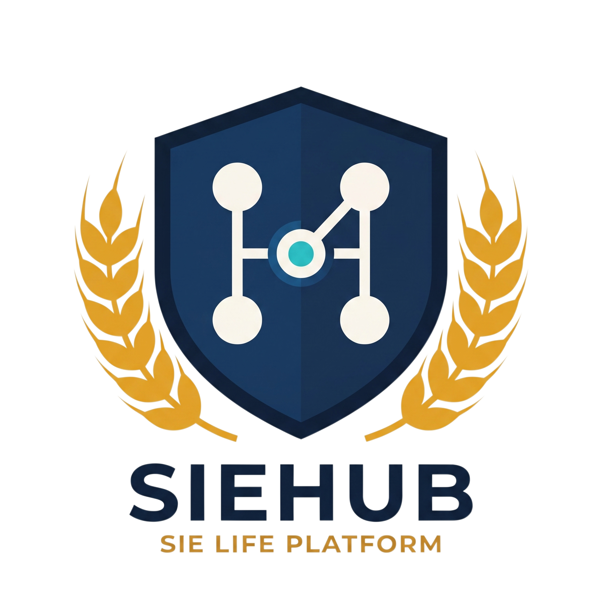

#  SIEHUB 北京化工大学国际教育学院学生工作平台

SIEHUB 是北京化工大学国际教育学院面向团委、学生会和普通学生的一体化学生工作平台。系统以“统一身份认证、部门模块分流、成熟业务系统接入”为核心，承载学生权益反馈、课程资源共享、部门主页展示、组织治理、绩效管理等功能。

旧版单系统说明已归档为：[SIEVOX 学生权益反馈系统 v1](./docs/SIEVOX学生权益反馈系统.v1.md)。

## 当前平台定位

SIEHUB 当前不是单一反馈系统，而是学院学生工作模块的一级入口：

- 普通学生从统一登录页进入后，可访问各部门学生端。
- 部门负责人、团委学生兼职团干部、主席团成员、团委学生兼职副书记和终极管理员，可按所属或分管范围进入对应管理端。
- 学生权益部继续通过 SIEVOX 承载成熟权益反馈业务。
- 学术科技部通过 SIEBridge 承载课程资源共享业务。
- 其他部门保留统一的“部门介绍 / 学生服务入口 / 通知与活动”结构，并逐步接入专属能力。

## 核心功能

### SIEHUB 一级平台

- 统一身份认证：登录后按身份与权限进入学生端、部门管理端或终极管理端。
- 中英文切换：登录页、SIEHUB、SIEVOX、SIEBridge 和主要管理界面支持中文 / EN 切换。
- 隐私条款：首次访问按 IP 弹出隐私条款，登录时需勾选同意。
- 邮箱验证：注册需绑定唯一邮箱并校验验证码；找回密码通过绑定邮箱验证码完成。
- 组织权限：支持学生、志愿者、部门负责人、团委学生兼职团干部、主席团成员、团委学生兼职副书记、终极管理员等身份。

### 部门学生端

每个部门学生端保留三类入口：

1. 部门介绍
2. 学生服务入口
3. 通知与活动

学生权益部的学生服务入口进入 SIEVOX。学术科技部的学生服务入口进入 SIEBridge 课程资源共享平台。

### 部门介绍页面编辑器

各部门负责人和分管主席团成员 / 团委学生兼职副书记可在管理端新增的“部门介绍编辑”入口中维护部门介绍页。原“部门工作台 / 规划中”入口保持不变。

编辑器采用受控区块式设计，避免任意 HTML/CSS/脚本带来的安全和上线风险。当前支持：

- 顶部封面
- 文本介绍
- 图片展示
- 视频展示
- 部门职责
- 联系方式
- 中英文内容字段
- 区块排序、删除、保存草稿、发布
- 发布记录展示
- 图片和 mp4 视频上传

### SIEVOX 学生权益反馈系统

SIEVOX 作为学生权益部成熟模块继续运行，主要功能包括：

- 学生权益反馈提交
- 反馈分类、匿名提交与进度查询
- 管理员受理、回复、状态流转
- 反馈审计日志
- 志愿者绩效管理
- 学期管理、成员名单、批量赋分、绩效流水撤回与期末动态加权结算

### SIEBridge 课程资源共享平台

SIEBridge 是学术科技部学生服务入口，面向课程资料共享场景：

- 按专业、年级分类课程资源
- 支持机械设计制造及其自动化、生物工程、工业设计三个专业
- 每个课程包含课程代码、课程名称、课程性质、所属专业、年级等信息
- 资料分区包含往年真题、课件、笔记整理和其他资料
- 学生可按课程代码或课程名称搜索
- 所有人可上传资料或申请新增课程
- 新增课程和上传资料需经分管学术科技部的主席团成员 / 团委学生兼职副书记或终极管理员审核
- 上传者可查看审核状态
- PDF 文件支持预览和下载

### 组织治理中枢

终极管理员可进入 SIEHUB 组织治理中枢，维护：

- 届次与归档
- 成员身份
- 所属组织与部门
- 分管部门
- 绩效归档相关信息

删除届次等高风险操作需要严格确认，避免误删。

## 技术架构

| 层级 | 技术 |
| --- | --- |
| 前端 | React 18、Vite、lucide-react、CSS Modules 风格的全局样式文件 |
| 后端 | Node.js、Express、Mongoose |
| 数据库 | MongoDB |
| 认证 | JWT、bcrypt |
| 邮件 | nodemailer + SMTP |
| 上传 | multer，本地上传目录，按业务模块分目录存储 |
| 安全 | Helmet、CORS、mongo-sanitize、xss-clean、hpp、compression、审计日志 |

## 项目结构

```text
student-feedback-system/
├── backend/
│   ├── server.js                    # Express 主服务，认证、SIEVOX、SIEHUB、部门介绍等接口
│   ├── organization.js              # 组织、部门、身份、模块权限配置
│   ├── siebridge.js                 # SIEBridge 课程资源共享平台后端路由
│   ├── uploads/                     # SIEVOX 通用上传目录，运行时生成
│   ├── siebridge_uploads/           # SIEBridge 资料上传目录，运行时生成
│   ├── department_intro_uploads/    # 部门介绍页媒体上传目录，运行时生成
│   ├── .env.example
│   └── package.json
│
├── frontend/
│   ├── src/
│   │   ├── App.jsx                  # SIEHUB、登录页、部门入口、SIEVOX 入口编排
│   │   ├── AdminDashboard.jsx       # SIEVOX 管理端
│   │   ├── SIEBridge.jsx            # SIEBridge 学生端与审核端
│   │   ├── DepartmentIntroduction.jsx # 部门介绍页渲染与编辑器
│   │   ├── api.js
│   │   ├── index.css
│   │   ├── siehub.css
│   │   ├── siebridge.css
│   │   └── sievox-runtime.css
│   ├── public/
│   ├── dist/                        # 前端构建产物，运行 npm run build 后生成
│   └── package.json
│
├── docs/
│   └── SIEVOX学生权益反馈系统.v1.md
│
├── DEPLOYMENT.md
├── QUICKSTART.md
├── SIEHUB_HANDOFF_TO_REMOTE_DEPLOY_20260726.md
└── README.md
```

## 本地开发

### 环境要求

- Node.js >= 18.0.0
- MongoDB >= 6.0
- npm

### 后端启动

```bash
cd backend
npm install
cp .env.example .env
npm start
```

默认后端地址：

```text
http://localhost:3101
```

### 前端启动

```bash
cd frontend
npm install
npm run dev
```

默认前端地址：

```text
http://localhost:3000
```

如需指定前端代理到其他后端端口：

```bash
VITE_API_PROXY_TARGET=http://localhost:3102 npm run dev -- --port 3001
```

Windows PowerShell：

```powershell
$env:VITE_API_PROXY_TARGET='http://localhost:3102'
npm run dev -- --port 3001
```

## 环境变量

后端环境变量参考 `backend/.env.example`。重点配置包括：

| 变量 | 说明 |
| --- | --- |
| PORT | 后端端口，默认 3101 |
| MONGODB_URI | MongoDB 连接地址 |
| JWT_SECRET | JWT 签名密钥 |
| JWT_EXPIRE | JWT 有效期 |
| SMTP_HOST | 邮箱验证码 SMTP 主机 |
| SMTP_PORT | SMTP 端口 |
| SMTP_SECURE | 是否使用 SSL/TLS |
| SMTP_USER | SMTP 登录账号 |
| SMTP_PASS | SMTP 授权码或密码 |
| SMTP_FROM | 发件人名称和地址 |
| WECHAT_MP_ENABLED | 是否启用“国教空间”微信公众号自动同步 |
| WECHAT_MP_APP_ID | 微信公众号 AppID，仅保存在后端环境变量 |
| WECHAT_MP_APP_SECRET | 微信公众号 AppSecret，不提交仓库、不输出日志 |
| WECHAT_MP_ACCOUNT_NAME | 首页展示的公众号名称，默认“国教空间” |
| WECHAT_MP_ACCOUNT_URL | 首页公众号封面点击跳转地址 |
| WECHAT_MP_COVER_IMAGE_URL | 首页公众号封面图 URL |
| WECHAT_MP_QR_IMAGE_URL | 无封面/无跳转时展示的二维码 URL |
| WECHAT_MP_FALLBACK_DESCRIPTION | 未配置跳转或封面时展示的备用说明 |
| WECHAT_MP_SYNC_INTERVAL_MINUTES | 后续定时同步间隔配置，当前手动同步接口会读取同一配置 |
| WECHAT_MP_NOTICE_ORGANIZATION / WECHAT_MP_NOTICE_DEPARTMENT | 微信文章同步到 DepartmentNotice 的目标部门 |

## 主要 API

### 认证与账号

| 方法 | 路径 | 描述 |
| --- | --- | --- |
| POST | /api/auth/register | 注册账号，需邮箱验证码 |
| POST | /api/auth/login | 登录 |
| GET | /api/auth/me | 获取当前用户 |
| PUT | /api/auth/password | 修改密码 |
| POST | /api/auth/email-code | 发送注册或找回密码验证码 |
| POST | /api/auth/reset-password | 通过邮箱验证码找回密码 |

### SIEHUB

| 方法 | 路径 | 描述 |
| --- | --- | --- |
| GET | /api/hub/me | 获取当前用户的 SIEHUB 模块权限 |
| GET | /api/organization/meta | 获取组织、部门、身份元数据 |
| GET | /api/hub/notices | 获取首页消息中心已发布部门通知，支持部门和时间筛选 |
| GET | /api/hub/wechat-mp | 获取“国教空间”公众号首页入口公开配置 |
| POST | /api/hub/wechat-mp/sync | 终极管理员手动触发公众号文章同步 |
| POST | /api/hub/wechat-mp/import | 终极管理员粘贴公众号推文链接进行临时导入 |

### 部门介绍页

| 方法 | 路径 | 描述 |
| --- | --- | --- |
| GET | /api/hub/departments/:organization/:department/introduction | 获取学生端已发布介绍页 |
| GET | /api/hub/departments/:organization/:department/introduction/editor | 获取管理端草稿和版本信息 |
| PUT | /api/hub/departments/:organization/:department/introduction/draft | 保存部门介绍草稿 |
| POST | /api/hub/departments/:organization/:department/introduction/publish | 发布部门介绍页 |
| POST | /api/hub/departments/:organization/:department/introduction/media | 上传部门介绍页图片或视频 |
| GET | /api/hub/departments/:organization/:department/notices | 获取部门通知列表，管理端可看草稿/已发布/归档 |
| POST | /api/hub/departments/:organization/:department/notices | 新建部门通知 |
| PATCH | /api/hub/departments/:organization/:department/notices/:id | 更新、发布、撤回或归档部门通知 |

### SIEBridge

| 方法 | 路径 | 描述 |
| --- | --- | --- |
| GET | /api/siebridge/meta | 获取专业、年级和资料分区元数据 |
| GET | /api/siebridge/courses | 查询课程 |
| POST | /api/siebridge/courses | 申请新增课程 |
| POST | /api/siebridge/courses/:courseId/resources | 上传课程资料 |
| GET | /api/siebridge/submissions/mine | 查看我的提交审核状态 |
| GET | /api/siebridge/reviews | 审核工作台 |
| PATCH | /api/siebridge/reviews/:type/:id | 审核课程或资料 |
| DELETE | /api/siebridge/resources/:id | 删除已审核通过资料，需提交标题或“确认删除” |
| GET | /api/siebridge/resources/:id/preview | 预览 PDF 资料 |
| GET | /api/siebridge/resources/:id/download | 下载资料 |

### SIEVOX 反馈

| 方法 | 路径 | 描述 |
| --- | --- | --- |
| POST | /api/feedback | 提交反馈 |
| GET | /api/feedback/my | 获取我的反馈 |
| GET | /api/feedback/:id | 获取反馈详情 |
| GET | /api/admin/feedbacks | 获取全部反馈 |
| PATCH | /api/admin/feedback/:id/status | 更新反馈状态 |

## 构建与验证

前端构建：

```bash
cd frontend
npm run build
```

后端测试：

```bash
cd backend
npm test
```

当前开发过程中已验证：

- 后端 `node --test` 通过
- 前端 `vite build` 通过
- SIEBridge 已部署到远端服务器
- 部门介绍编辑器部署交接见 [SIEHUB_HANDOFF_TO_REMOTE_DEPLOY_20260726.md](./SIEHUB_HANDOFF_TO_REMOTE_DEPLOY_20260726.md)

## 部署注意事项

- 不要只发布前端。涉及 SIEBridge 或部门介绍编辑器时，必须先确认后端 API 已同步并重启。
- 不要覆盖或清空 MongoDB。
- 不要删除线上上传目录：
  - `backend/uploads`
  - `backend/siebridge_uploads`
  - `backend/department_intro_uploads`
- 同步 `backend/server.js` 时，必须保留已上线的 SIEBridge 路由，并叠加部门介绍页路由。
- 前端 `dist` 应整目录同步，避免 hash 资源缺失。

## 文档索引

- [SIEVOX 学生权益反馈系统 v1](./docs/SIEVOX学生权益反馈系统.v1.md)
- [快速启动](./QUICKSTART.md)
- [部署说明](./DEPLOYMENT.md)
- [远端部署交接](./SIEHUB_HANDOFF_TO_REMOTE_DEPLOY_20260726.md)

## 许可证与版权

MIT License

贡献者：赵启涵(BUCT SIE)

Copyright© 2026 赵启涵

本项目（包括但不限于前端 React 代码、Node.js 后端及数据库设计）已申请并获得软件著作权。保留所有权利。

京ICP备2026010091号-1
京公网安备11011402055565号
